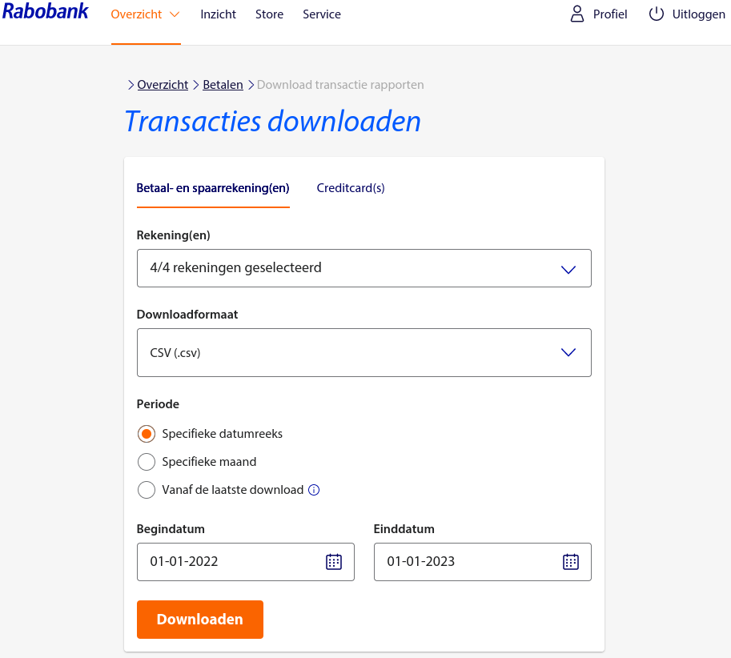
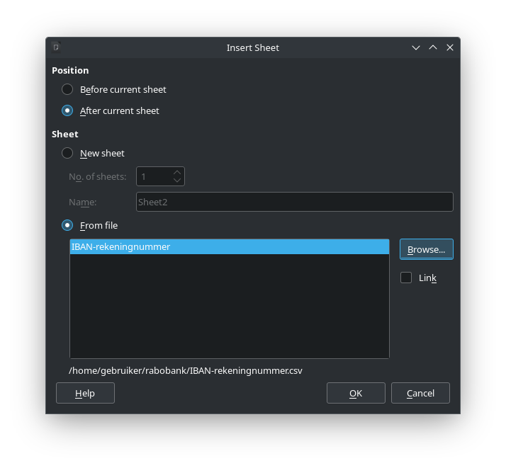
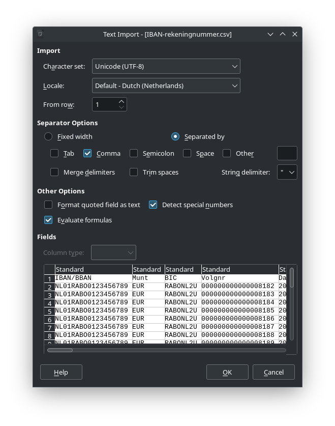

# Conversietool voor Rabobank-CSV naar spreadsheet
De Rabobank biedt de mogelijkheid om de mutaties op de rekeningen te downloaden in CSV-formaat voor gebruik in de eigen administratie.<br>
Dit Python-programma kan zo'n CSV lezen, converteren, rubriceren en organiseren voor gebruik in een spreadsheet.<br>
Ik heb het geschreven voor eigen gebruik, maar wellicht doe ik er anderen plezier mee.<br>
Gebruik ervan is voor eigen risico.  Ik adviseer sowieso om in je spreadsheets altijd een snelle controle uit te voeren om vast te stellen dat de lijst van mutaties sluitend is.  Hoe je dit eenvoudig doet leg ik verderop uit.
## Werking van het programma
Als invoer verwacht het programma (```'rabo_csv.py'```) een CSV-bestand wat je eerder hebt gedownload via Rabo Internetbankieren.<br>
Dit CSV-bestand mag mutaties bevatten van meerdere rekeningen.<br>
```'rabo_csv.py'``` zal de mutaties automatisch per rekening uitsplitsen in aparte uitvoerbestanden.<br>
Het programma voert de volgende bewerkingen uit:

* Leest de invoer-CSV in en converteert het naar intern formaat (een *list of dictionaries*).
* Leest de matching-CSV in en converteert het naar intern formaat (een *list of dictionaries*).<br>
  De matching-CSV bevat de rules aan de hand waarvan de mutaties gerubriceerd worden.
* Scant het invoerbestand op rekeningnummers en registreert die in een lijst van rekeningen.
* Voor elke geregistreerde rekening...
    * Rubriceert alle mutaties aan de hand van een tabel met regular expressions.<br>
      Records die niet matchen met een regex worden gelogd in de logfile.
    * Converteert de invoer-records naar een praktisch formaat voor gebruik in een spreadsheet.<br>
      Het voegt hierbij ook enkele nieuwe kolommen toe, namelijk:
        * Een volgnummer (```'Nr'```, eerste kolom)
        * ```'Bedrag bij'``` en ```'Bedrag af'```<br>
      (de kolom ```'Bedrag'``` uit het invoerbestand wordt weggelaten in de uitvoerbestanden)
        * ```'Rubriek bij'``` en ```'Rubriek af'```
    * Sorteert de uitvoer-records op ```'Rubriek'```, ```'Relatienaam'``` en ```'Nr'```.
    * Plaatst formules in de kolommen ```'Rubriek bij'``` en ```'Rubriek af'``` voor de berekening van de totalen per rubriek.
    * Schrijft per rekening een uitvoerbestand in CSV-formaat.

Het programma logt elk mutatierecord dat niet gematched kon worden.<br>
Aan de hand van de logfile kun je de matching-CSV makkelijk aanpassen en uitbreiden.

De uitvoerbestanden kunnen eenvoudig worden geïmporteerd in een Excel of Libreoffice spreadsheet.
Dit wordt verderop uitgelegd.

# Handleiding
Voorlopig gaat deze handleiding uit van het Linux operating system en Libreoffice.<br>
Misschien volgt in de toekomst ook een op Windows georiënteerde uitleg.
## Vereisten
Het programma is geschreven in Python, dus dat moet geïnstalleerd zijn op je machine.<br>
Het maakt gebruik van diverse Python-modules, waarvan er één niet standaard aanwezig is op elke machine, namelijk ```chardet```.  Installeer deze module indien nodig.
## Installatie
1. **Download of clone het project van Gitlab en pak het uit, bijvoorbeeld in ```/tmp```**
2. **Plaats het programma ```'rabo_csv.py'``` in /usr/local/bin**
    ```
    $ sudo cp rabo_csv.py /usr/local/bin
    ```
3. **Beveilig het progamma en maak het executable**
    ```
    $ sudo chown root: /usr/local/bin/rabo_csv.py
    $ sudo chmod 0755 /usr/local/bin/rabo_csv.py
    ```
4. **Maak een directory aan waarin je wilt gaan werken, bijvoorbeeld**
    ```
    $ mkdir ~/rabobank
    ```
5. **Plaats het bestand ```'matching.csv'``` in de nieuwe directory**
    ```
    $ cp matching.csv ~/rabobank
    ```
## Gebruik
1. **Download de mutaties van al je rekeningen**<br>
    
2. **Plaats het gedownloade CSV-bestand in de directory die je tijdens de installatie hebt aangemaakt**
    ```
    $ cp gedownloade_mutaties.csv ~/rabobank
    ```
3. **Pas de rules in het bestand ```'matching.csv'``` aan**<br>
   Eventueel kun je deze stap ook eerst overslaan en eens kijken wat er gebeurt.
4. **Verwerk de gedownloade mutaties**<br>
    ```
    $ pwd
    /home/gebruiker/rabobank
    $ rabo-csv.py --infile gedownloade_mutaties.csv --matchfile matching.cvs --logfile logfile
    ```
    Per rekening zal er een uitvoerbestand aangemaakt zijn met als naam ```'IBAN-rekeningnummer.csv'```.<br>
    In de aangemaakte logfile vind je een overzicht van alle mismatches en eventuele andere problemen.<br>
    Na het bestand ```'matching.csv'``` aangepast te hebben kun je het programma snel opnieuw draaien als volgt:
    ```
    $ rm NL* logfile && rabo-csv.py --infile gedownloade_mutaties.csv --matchfile matching.cvs --logfile logfile
    ```
5. **Laad de uitvoerbestanden in een spreadsheet (voorbeeld met Libreoffice Calc)**<br>
    a. Start Libreoffice Calc.<br>
    b. Klik met de rechter muistoets in de balk met de spreadsheet-tabs.<br>
    c. Selecteer één van de aangemaakte CSV-bestanden met rekening-mutaties.<br>
        <br>
    d. Stel de import-parameters correct in.<br>Vergeet niet de optie "Evaluate formulas" aan te zetten!<br>
        <br>
    Na op \<OK\> geklikt te hebben verschijnt het spreadsheet in een nieuw tabblad.
## Matching
De eerste keer dat je dit programma gebruikt moet je een bestand ```'matching.csv'``` opstellen met rules die alle mutaties matchen en toewijzen aan een rubriek.<br>
In latere jaren zal het merendeel van de mutaties nog steeds matchen, en hoef je de ```'matching.csv'``` alleen aan te passen voor een eperkt aantal gemismatchte mutaties. (zie logfile)<br>
De matching gebeurt op basis van *Python regular expressions*. (https://docs.python.org/3/library/re.html)<br>
Het is toegestaan om meerdere rules voor dezelfde rubriek (```'Category'```) op te nemen in het bestand ```'matching.csv'```.<br>
Onder ```'Column'``` verwacht het programma de naam van een kolom uit de CSV van de Rabobank (het invoerbestand).<br>
Hier volgt een voorbeeld van enkele matching-rules die in de ```'matching.csv'``` zouden kunnen staan.
```
"Category","Column","Regex"
"Auto brandstof","Naam tegenpartij","(?i)(Shell|ESSO|Tango|Total)"
"Auto verzekering","Omschrijving-1","(?i)autoverzekering"
"Auto wegenbelasting","Omschrijving-1","AB-123-C"
"Bankkosten","Naam tegenpartij","^(Creditrente|Debetrente|Kosten)"
"Bankkosten","Omschrijving-1","^(Eff.nota Kwartaalafrek. beleggen)"
"Belastingen inkomsten","Naam tegenpartij","(?i)(Belastingdienst|BghU)"
"Hond verzorging","Naam tegenpartij","(?i)(Diebo|Welkoop|ZOOPLUS|OnlinePets|Pets Place|Jumper|Max en Luna)"
"Horeca","Naam tegenpartij","(?i)(cafetaria|restaurant|brasserie|horeca|italiaans|grieks|herberg)"
"Huishouden","Naam tegenpartij","(?i)(Albert Heijn|Jumbo|Lidl|Gall|Kruidvat|Makro|Primera|Hornbach)"
.
.
.
```
_Advies:_<br>
Voeg een rule toe met in de in de regex alle bankrekeningen die je bezit, óók die bij andere banken en instellingen, met als Category "Interne boeking":
```
"Interne boeking","Tegenrekening IBAN/BBAN","(IBAN1|IBAN2|IBAN3|IBAN5|IBAN5)"
```
Dit zal alle overboekingen tussen eigen rekeningen automatisch markeren als "Interne boeking".<br>
Alle interne boekingen tussen de eigen rekeningen zouden opgeteld op 0 (nul) moeten uitkomen, anders klopt er iets niet.
## Formaat van de uitvoer
De aangemaakte uitvoerbestanden hebben de volgende kolom-indeling:
```
| Nr | Boekdatum | Rentedatum,Rekening (IBAN) | Rubriek | Bedrag bij | Bedrag af | Rubriek bij | Rubriek af | Saldo | Omschrijving | Tegenrekening (IBAN) | Relatienaam |
```
De eerste kolom bevat een door het programma toegekend oplopend volgnummer.<br>
Dit maakt het mogelijk om de mutaties altijd weer te sorteren in de volgorde van het oorspronkelijke CSV-bestand van de Rabobank.<br>
De kolom ```'Saldo'``` bevat de saldi uit het oorspronkelijke CSV-bestand van de Rabobank.
## Controle van de integriteit/compleetheid van het mutatie-overzicht
Op de volgende manier kun je controleren of de gegevens in het spreadsheet compleet en sluitend zijn:
1. **Maak een tijdelijke kopie van het spreadsheet**
2. **Sorteer het spreadsheet op uitsluitend de eerste kolom (```'Nr'```).**
3. **Voeg een nieuwe kolom in achter de kolom ```'Saldo'``` en noem deze ```'Controle'```**
4. **Voeg een nieuwe regel in, direct onder de eerste regel (die met de kolomnamen), en plaats daarin onder de kop ```'Saldo'``` het beginsaldo van dat jaar**
5. **Plaats in de regel met ```'Nr'``` 1 in de cel van de kolom ```'Controle'``` de volgende formule**<br>
    ```
    =ROUND(J2+F3-G3-J3;2)
    ```
6. **Kopieer deze formule naar alle cellen eronder in de kolom ```Controle```**<br>
   Als het goed is moet deze formule in alle cellen van de kolom ```Controle``` de waarde 0 (nul) opleveren.
## Syntax
```
$ rabo-csv.py --help
usage: rabo-csv.py [-h] --infile INFILE --matchfile MATCHFILE [--outdir OUTDIR] [--logfile LOGFILE] [--verbosity {1,2,3,4}]

This program reads a Rabobank CSV, splits it into separate accounts,
categorizes the transactions and converts the output to a format
suitable to support the annual income tax declaration in a spreadsheet.

options:
  -h, --help            show this help message and exit
  --infile INFILE
  --matchfile MATCHFILE
  --outdir OUTDIR
  --logfile LOGFILE
  --verbosity {1,2,3,4}

```
Uitleg van de argumenten:
| Argument                                   | Toelichting |
| ------------------------------------------ | ------------------- |
| ```--infile <gedownloade_mutaties.csv>```  | Verplicht argument. |
| ```--matchfile <matchfile.csv>```          | Verplicht argument. |
| ```--outdir <output_directory>```          | Optioneel argument. Default is de locatie van de infile. |
| ```--logfile <logfile>```                  | Optioneel argument. Default is stderr (= het console) |
| ```--verbosity <number between 1 and 4>``` | Optioneel argument. Default is 2. Mogelijke waarden:<br>1: errors<br>2: errors en warnings<br>3: info, errors en warnings<br>4: alles, inclusief DEBUG-messages |

